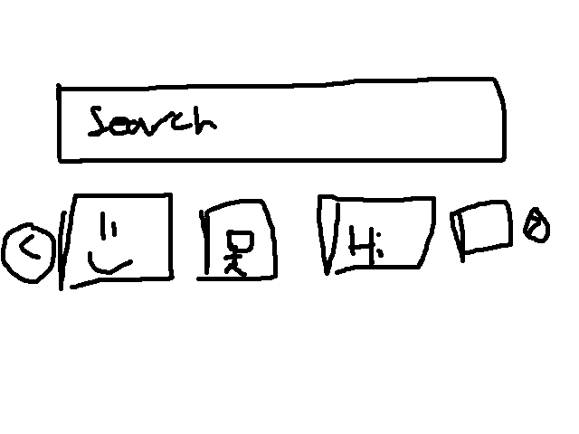
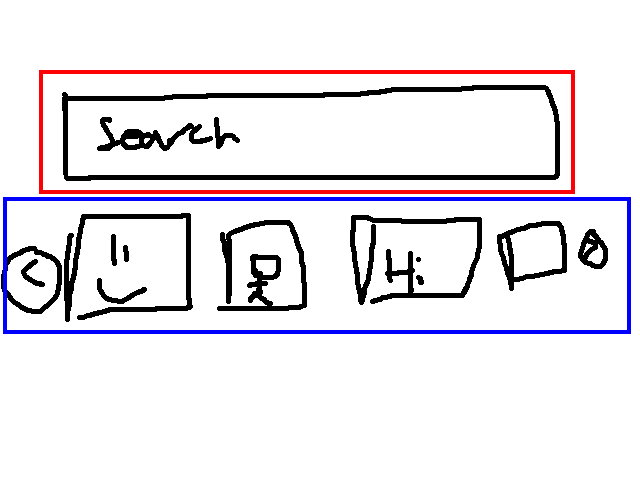
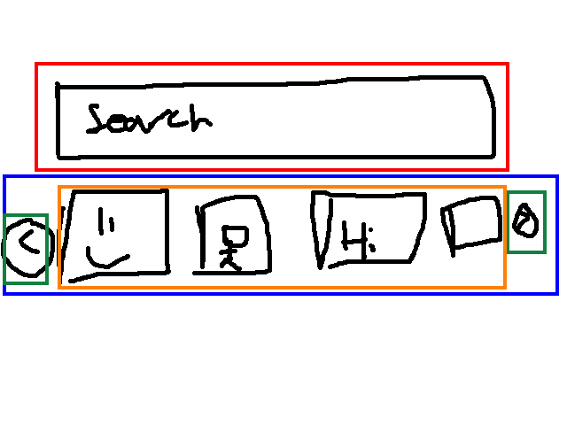
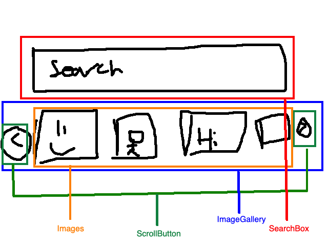
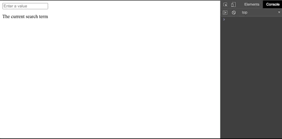
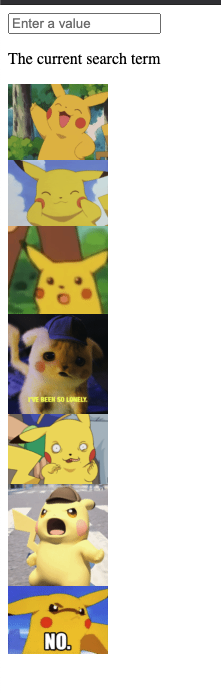

# Tutorial: Intro to Marko

This tutorial doesn't assume any existing Marko knowledge.

## Before We Start the Tutorial {#before-we-start-the-tutorial}

We will build a GIF Keyboard using the [GIPHY API](https://developers.giphy.com/docs/api#quick-start-guide) during this tutorial. While this tutorial will go over most features of Marko, the code may not follow the best coding practices for Marko projects. Nevertheless, the features and techniques in the tutorial are used to building any Marko Application and mastering them will give you a deep understanding of how Marko works.

> Tip:
>
>This tutorial is design for people who **learn by doing** or **learn by example.** To get overview of Marko and its syntax, you can check out the [reference](https://markojs.com/docs/reference-overview/) section and play around with some of the [examples](https://markojs.com/try-online/?file=%2Fmarko-color-picker%2Findex.marko&gist=) that we have.


The tutorial is divided into several sections:

* [Setup for the Tutorial](#setup-for-the-tutorial) will give you **a starting point** to follow the tutorial.
* [Overview](#overview) will teach you **the fundamentals** of Marko how Marko works.

### What Are We Building? {#what-are-we-building}

In this tutorial, we'll show how to build a GIF Keyboard with Marko using the GIPHY API.

You can see what we'll be building here: **[Final Result]()**. Don't worry if this doesn't make sense! The goal of this tutorial is to help you understand Marko and its syntax.

### Prerequisites {#prerequisites}

We will assume you have basic knowledge of HTML, CSS and JavaScript.

## Setup for the Tutorial {#setup-for-the-tutorial}

We recommend that you set up your Marko Project locally. Here are the steps to follow:

1. Make sure you have a recent version of [Node.js](https://nodejs.org/en/) installed.
2. Follow the [installation instructions for Marko cli](https://markojs.com/docs/installing/) to make a new project. Once installed, follow the steps:

```bash
npx @marko/create
***Type your project name*** > marko-giphy-keyboard
```

```bash
Choose a template …  Use ↑ and ↓. Return ⏎ to submit.
❯ Default starter app // Select this option
  Example from marko-js/examples
```

3. Access the project by going into the `marko-giphy-keyboard` folder and open the source code with your favorite editor. Then run the following commands to run the program:


```bash
cd marko-giphy-keyboard
npm run dev
```

Open `http://localhost:3000` in the browser, you see this following:

[Insert the marko start image here]

We recommend following [using a Marko Syntax Highlighting Editor plugin](https://markojs.com/docs/editor-plugins/) for your editor.

### Help, I'm Stuck! {#help-im-stuck}

If you get stuck, check out our [StackOverFlow page](https://stackoverflow.com/questions/tagged/marko). You can also check out our [Marko Glitter Chat](https://gitter.im/marko-js/marko) and post your questions.

### Getting the GIPHY API Key

You will need to get an API Key from [GIPHY](https://giphy.com/) to fetch data from the GIPHY API. You can do so by following the [quickstart guide](https://developers.giphy.com/docs/api#quick-start-guide). For your convenience, we have include instructions below:

<details>

1. In the GIPHY quickstart guide, click on the `Create an App` button.

2. On the Dashboard page, click the `Create an App` button. In the dialog, select the `Select API` option.

3. For `Your App Name`, you can enter "Marko Sample GIF Keyboard" for the name of the application. For the description, you can write "For Marko based GIF keybard". Then select `Create App`.

4. Get your API key! It should be a randomly generated string. Be sure to save that string somewhere safe as you will need it later.
</details>

## Overview of Marko {#overview}

Before we dive right into building, let's talk get an overview of how Marko works.

### What is Marko?

Marko is a high-performing, efficient Front End library for building user interface components without much boilerplate. Marko is heabily optimized for fast rendering that easily scales, easily maintainable and easily writable. If you know HTML, CSS and JavaScript, you will feel right at home with Marko.

Lets do an overview of Marko using an example. Example from [Marko Counter Example](https://markojs.com/try-online/?file=%2Fgist%2Fcomponents%2Fcounter%2Fstyle.css&gist=8fe46bc5866605aca0dfeec202604011). You also can view a portion of this example by clicking down on the dropdown below.

<details>

```js
class {
  onCreate() {
    this.state = { count: 0 };
  }
  increment(delta) {
    this.state.count += delta;
  }
}

$ var count = state.count;

<div.click-count>
  <div.count class={
      positive: count > 0,
      negative: count < 0
    }>
    ${count}
  </div>
  <button on-click('increment', -1)>
    -1
  </button>
  <button on-click('increment', 1)>
    +1
  </button>
</div>

style {
  .click-count button {
      background: #4285f4;
      color: #ffffff;
      border: 1px solid #1266f1;
      display: inline-block;
      padding: 12px 32px;
      height: 26px;
      line-height: 26px;
      cursor: pointer;
  }

  .click-count .count {
      background: #fff;
      border: 1px solid #1266f1;
      display: inline-block;
      height: 26px;
      line-height: 26px;
      vertical-align: middle;
      padding-right: 13px;
  }

  .click-count .count.positive {
      background: rgb(86, 239, 165);
  }

  .click-count .count.negative {
      background: rgb(235, 182, 176);
  }
}

```
</details>


Don't worry if you don't understand even most of the code. We will explain the specific features of Marko in greater detail. What this code snippet shows is that we can write components using HTML, CSS and JavaScript.

A component in Marko is basically a building block for a user interface. What Marko allows is the building parts of a UI which we can then use to build an entire interface.

In this example, the `Counter` component compromises of three other components, the `click-count` callbacks div, and the two `button` that are built in with their corresponding `on-click` functions and styles. We can then call this component in another file by referring it as `<Counter />`

Notice that in the example, we have a `this.state` in this component.  This is known as the *state* of the component, which is essentially the properties of a component. We will talk more about state and how we can pass them around our application, so don't worry if it doesn't make much sense yet.

#### How does Marko Work?

Lets look at a simpler example. Again, don't freak out if you don't understand the syntax for Marko just yet.

Suppose we have a component called `<list-of-numbners />` that looks something like this:

```html
<div.list-of-numbers>
  <for|count| from=1 to=5 step=1>
    <li key=count>
      ${count}: {count}
    </li>
  </for>
</div>
```

If we then call `<list-of-numbers />` from another component, the output HTML would be

```html
<div.list-of-numbers>
  <li key=1>
    1: 1
  </li>
  <li key=2>
    2: 2
  </li>
  <li key=3>
    3: 3
  </li>
  <li key=4>
    4: 4
  </li>
  <li key=5>
    5: 5
  </li>
</div>
```

That's right, Marko components output HTML. Alright, it's an oversimplication. What actually happens is that Marko renders the `<list-of-numbers />` directly to the VDOM which then quickly renders the view on the browswer.

What is a VDOM? At a high level, a VDOM is just a representation of the actual DOM (the actual model that is render on the browswer) that is more efficient to update than DOM maniuplation. The implementation details on how Marko does it can be found [here](https://markojs.com/docs/why-is-marko-fast/).

The `<list-of-numbers />` component only renders the build-in DOM components as the above code snippet above. We are allowed to compose components with other components we made. This for example, we can have a component called `<three-lists-of-numbers` /> by writing the following:

```html
<div.three-lists-of-numbers>
  <list-of-numbers />
  <list-of-numbers />
  <list-of-numbers />
</div>
```

The above component (`<three-list-of-numbers />`) will render the `<list-of-numbers />` three time every time we call `<three-list-of-numbers />`. Although the example is a bit contrieved, the example shows that we can encapsulate components inside other components. This allows us to build more complex UIs from simplier components.

## Before Coding

### Identifying the main components and subcomponents

Before we start to write code for out GIF Keyboard, it is worth spending some time planning ahead as to what the application would look like and what are the major components of our application.

Here's a rough mock of what our GIF Keyboard would look like:



The first thing to do is figure out what the main components are for the application. Once we identify the main components, we identify the sub-components of those main components. We can keep doing this, in this application however, it identifying the main components and the corresponding subcomponents should be enough.

The image below displays the mock and the main components.



In this image, we have two main components for our GIF keyboard. We will let the red main component to be `<SearchBox />` and the blue main component to be `<ImageGallery />`.

The `<SearchBox />` Component will be take in user input and then passes the term to GIPHY and loads the result on the `<ImageGallery />` component. We will talk more about the `<SearchBox />` component later. The `<ImageGallery />` component will display all the relevant gifs from the user input in `<SearchBox />` and two buttons, left and right, that will allow them to scroll through gifs.

Since we are allowed to encapsulate Marko components with other components, we can break the `<ImageGallery />` into subcomponents. The subcomponents for `<ImageGallery />` are boxed below in green and orange.



We will name the orange subcomponent as `<Images />` subcomponent and the green subcomponents as `<ScrollButtons />`. Notice that while we identified three subcomponents, we only need to write two new subcomponents. We will go into further details once we start writing code for these components and subcomponents.

Here is the component hierarchy we have identified:

```
giphy-keyboard
  - SearchBox
  - ImageGallery
    - Images
    - ScrollButton
```

And here's the component hierarchy in picture:



### Before Starting Marko with this Project

There are a couple of things that we need to do before we starting writing the components for this project.

We need to install [node-fetch](https://github.com/node-fetch/node-fetch), which can be done by:

```npm install --save node-fetch```

Next, we should create a `.constants` file that we will use to access the API key that we got from .giphy. In `marko-giphy-keyboard`, create a script called `APIKEY.constants.js`. Then in that file, save the following line:

```js
export const GIPHYAPIKEY = `Insert your GIPHY API Key in between the backtacks`;
```

You should have already [recieved your API Key from GIPHY](https://developers.giphy.com/docs/api#quick-start-guide). If not, follow the directions to revieve your API key and then insert that key in the above line.

Next go to the `.gitignore` file and add the following two lines at the bottom:

```
package-lock.json
*.constants.js
```

This is to prevent your git repo from getting too big as well as preventing your GIPHY API Key from being public. This may not be the best practice in a normal environment. For purpose of this tutorial, the hiding of the `package-lock` and the API key are suffice.

In `/src/pages/index/index.marko`, remove all the generated code and then add the following lines at the top:

```js
import fetch from 'node-fetch'
import {GIPHYAPIKEY} from './../../../APIKEY.constants.js'

class {
  displayAPIKey(){
    console.log('The API Key: ', GIPHYAPIKEY);
  }
}

<p on-click("displayAPIKey")>
  Hello Marko!
</p>
```

Run the program (`npm run dev`), then run go into the browswer console and make sure you're able to see your GIPHY API key in the console by clicking on `Hello Marko`. If you're able to see the API key after clicking on the element, you are good to go! You may also remove the `logo.svg` in the `index` folder.

We installed our require dependacy, prevented our API key from accidentally being made public and made our API key useable.

## Writing Code with Marko

As stated before, the purpose of this tutorial is to not necessarily write the most elegant or follow all the best practices of Marko. The purpose of this tutorial is to get an overview of Marko main features and how we can use them. This tutorial will first set up the appropriate HTML and JavaScript logic for each component. Then once each component is integrated with each other, we will focus on the styling (CSS).

### Searchbox in GIPHY and `state` in Marko

Before we implement the actual searching, what we are going to do first is implement the search box.

In `/src/pages/index/index.marko`, replace the `<p>` tag with the following:

```html
<input
  type="text"
  on-input("updateSearchTerm")
  placeholder="Enter a value"
  value=state.searchTerm
/>
<p>
  The current search term ${state.searchTerm}
</p>
```

In the class, remove the entire `displayAPIKey` signature and then add the following lines of code to the class:

```js
onCreate(){
  this.state = {
    searchTerm: null,
  }
}
updateSearchTerm(event){
  this.state = {
    searchTerm: event.target.value,
  }
}
```

Your code should look like this in the following dropdown in `/src/pages/index/index.marko`:

<details>

```js
import fetch from 'node-fetch'
import {GIPHYAPIKEY} from './../../../APIKEY.constants.js'

class {
  onCreate(){
    this.state = {
      searchTerm: null,
    }
  }
  updateSearchTerm(event){
    this.state = {
      searchTerm: event.target.value,
    }
  }
}

<input
  type="text"
  on-input("updateSearchTerm")
  placeholder="Enter a value"
  value=state.searchTerm
/>
<p>
  The current search term ${state.searchTerm}
</p>

```
</details>

The result is that as you type, the text should also change. Should look something like the following GIF:



Alright, that was a lot of new code that we added that you may not be familar with. Lets breakdown what we have added.

### The `onCreate` method

The `onCreate` signature that we have added initalizes the `state` for the component when the component gets created. We can also use the `onCreate` method to specify what should be done when the component gets created. Usually, the `onCreate` method is used to set the initial values for stateful components.

[Read more about the `onCreate` method](https://markojs.com/docs/class-components/#oncreateinput-out)

### The `state` object

The `this.state` is one of the most important Marko features. `this.state` refers to the state of the component, which is referred to as the *state* object. As mentioned previously, the *state* of the component are properties of a component.

When the state object changes, the component will be updated. This would include the children, or the components that are encapulsulated, to be re-rendered. Therefore, the *state object should only contain data that triggers rerenders*.

Only properties that exists when `this.state` is first defined (usually in the `onCreate`) are watched and defined. Therefore, if you don't need to use that state when the component is created, set it to `null`.

#### Updating the `state` object

We can update the state by directly modifying the state object. This can be done with the following form:

```js
this.state.propertyName = newValue;
```

As mentioned before, when the `state` object gets updated in a component, the entire component gets re-rendered.

[Read more about the `state` object](https://markojs.com/docs/state/)

In the context of our GIPHY Keyboard, we are using `updateSearchTerm` to update the `searchTerm` state to the input value as the user type.

In the HTML portion of our component, we can access the `state` value by using the form `state.propertyName`. In this project, we can keep track and render the `searchTerm` state in the HTML with `state.searchTerm`.

## Browser Events in Marko

In the example code, we added an event handler to the `<input>` tag. To attach an event handler in HTML, we normally do the following:

```html
<!-- The HTML way to attach an event handler -- >
<input oninput="functionSignature()" />
```

In Marko, we add an event handle like this:

```html
<input on-input("functionSignature") />
```

We essentally add a `-` between `on` and the name and then pass in the callback signature as a string. We could also pass in a callback directly into the event handle like so:


```html
<input on-input=(event => console.log(event.target.value)) />
```

In this case, we don't need to turn the function as a string.

For the purposes for building our GIF Keyboard, we added the `updateSearchTerm` to our event handler for our `<input />`. This means that every time a user inputs something in the searchox, the `searchTerm` states gets updated and the component gets re-rendered.

We will be building our own event handler later in this tutorial.

[This is what your code should look like currently](https://github.com/bvi1994/marko-keyboard-example/blob/part-one/src/pages/index/index.marko).

## What we have learned so far

Lets take a step back what we learned so far just by building the searchbar component.

 - `onCreate` method and what it does
 - Initializing `state` of a component, how to modify the value of the state and how to access the state in HTML
 - Attaching call back to event handlers

## Encapulation of a component (custom tags)

Lets encapsulate the component that we have written into one component now. First, remove both components in `src/components` (`app-layout.marko` and `mouse-mask.marko` components) that were generated by the `marko-create` helper.

In the `src/components` folder, create a folder called `search-bar`. Afterwards, create a file called `search-bar.marko`. Then cut the entire source code in `src/pages/index/index.marko` and paste it into the new `search-bar.marko` file that you just created.

In `index.marko`, put in the following lines:

```html
<search-bar />
```

The behavior should be exactly the same as it was before. If the behavior as it was before, we have successfully encapsulated a component and made it a custom tag!

### What is happening with encapulation?

Marko looks for a `/components/` folder which then looks the name of the custom tag that is used in that folder. You can also create subcomponents within components and create a `components` folder inside components. This will be demostrated later.

[Read more about custom tags](https://markojs.com/docs/custom-tags/)

## Creating the GIF Gallery

Lets review on what the `ImageGallery` component hierarchy looks like:

```
- ImageGallery
  - Images
  - ScrollButton
```

Looking at the mock up from earlier, `<Images>` would just be a bunch of images and we would have two `<ScrollButton`>s, one going left and one going right that will allow users to scroll through the results. We will be building those subcomponents inside `<image-gallery>`.

Create a folder called `image-gallery` inside the `components` folder. Then inside the `image-gallery` folder, create another `components` folder and a file called `image-gallery.marko`. Keep the inner `components` folder empty for now.

### How the GIPHY Request works

Lets take a side detour to how the GIPHY API works for this project. The relevant documentation can be found [here](https://developers.giphy.com/docs/api/endpoint/). We will be using [node-fetch](https://github.com/node-fetch/node-fetch) that will be serving our GET request to the GIPHY address.

Here is the end point we will be using:

```
http://api.giphy.com/v1/gifs/search?q=[search keyword]&rating=g&api_key=[API Key]&limit=[Display limit at a tie]&offset=[result index]
```

You can view the search request parameters as well as play around with the API explorer in the above link.

### Building the `image-gallery` Component

In `src/components/image-gallery/image-gallery.marko`, add the following lines:

```js
import fetch from 'node-fetch'
import {GIPHYAPIKEY} from './../../../APIKEY.constants.js'

class {
  onCreate(){
    this.state = {
      APIKey: GIPHYAPIKEY,
      giphyResponse: null,
      numberOfGifsToShow: 7,
      gifsToIndex: 5,
      currentIndex: 0,
    }
    this.getGifs();
  }
  getGifs(){
    let APIAddress = `http://api.giphy.com/v1/gifs/search?q=Pikachu&rating=g&api_key=${this.state.APIKey}&limit=${this.state.numberOfGifsToShow}&offset=${this.state.currentIndex}`;
    fetch(APIAddress)
      .then(
        response => response.json()
      )
      .then(
        data => this.state.giphyResponse = data.data
      )
      .catch(
        error => console.log('Error from getGifs() signature: ', error)
      );
    }
}

<div>
  <if(!state.giphyResponse)>
    <p>
      No response from GIPHY
    </p>
  </if>
  <else>
    <div>
      <for|image| of=state.giphyResponse>
        <div>
          <a
            href=image.bitly_url
            key=image.id
          >
            
          </a>
        </div>
      </for>
    </div>
  </else>
</div>
```

To make sure our component works, lets add `<image-gallery />` tag to `src/pages/index/index.marko` like so:

```html
<search-bar />
<image-gallery />
```

The result should be the following:



Note: Pikachu images may vary. [Here's what your code should look like at this point](https://github.com/bvi1994/marko-keyboard-example/commit/5c60a67b1a101a33bc6745267feb9e24178a6c45).

Okay, we just added bunch of new code, some of which you have never seen. Lets go over code we have just added.

The two import statement are just what they are. We will be removing them at a later time. We have already explained what `onCreate` and `state` are. In this case, we are just initalizing the state properties to the following values. `this.getGifs()` called `getGifs()` when the component loads.

`getGifs()` basically makes a request to the given address and parameters using `node-fetch`. When the [promise](https://developer.mozilla.org/en-US/docs/Web/JavaScript/Reference/Global_Objects/Promise/then) returns successful, it then changes the `giphyResponse` property of the state. If not, an error is loggeed.

### The Conditional Tags

In the HTML portion of the component, we have `<if>` and `<else>` tags. Those tags behave very similarly to if-else statements in JavaScript.

The `<if>` tag takes in an argument to see if anything should be rendered in between `<if>` and `</if>`. If there's an `<else>` tag, if the `<if>` tag failed, everything inside the `<else>` tag gets rendered.

`<else-if>` behaves exactly like it would with JavaScript.

[Read more about conditional tags](https://markojs.com/docs/conditionals-and-lists/#conditionals)

### The `for` tag

We also have a `for` tag in the HTML portion of the component. The `for` tag is very similar to a for-loop in JavsScript. There are a few varients of the `for` tag in Marko, which is explained in the documentation below.

[Read more about the `for` tag](https://markojs.com/docs/conditionals-and-lists/#lists)

For the GIPHY Keyboard, since the GIPHY response is an array, we would use the `<for|item, ... |  of=array` varient of the `<for>` tag.

***Be sure to always set a key when using the `for` tag!*** In the GIPHY keyboard, we will be using the `image.id` (inside the `<a>` tag) from each image as the key.

### Adding Scroll Buttons and `input`

Users currently can only see 7 gifs at a time without a way to scroll. We are going to add a `<scroll-button />` component that will enable users to scroll through GIFs.

In `src/components/image-gallery/components`, add a folder called `scroll-button` and inside the folder, add `scroll-button.marko`. Add the following lines in `scroll-button.marko`:

```html
<button>
  <if(input.direction === 'Prev')>
    <
  </if>
  <else-if(input.direction === 'Next')>
    >
  </else-if>
  <else>
    Direction Undefined
  <else>
</button>
```

Now back in the the `image-gallery` component, add the following lines in the following location:

```html
<else>
  <scroll-button
    direction='Prev'
  />
  <div>
    <for|image| of state.giphyResponse>
      ...
    </for>
  </div>
  <scroll-button
    direction='Next'
  />
</else>
```

[What the code should look like so far](https://github.com/bvi1994/marko-keyboard-example/commit/e23dca206b065a09a967895c62fd1bf0e11728f9)

We will add the functionally of the buttons in a little bit, right now we just want to make sure that we can render the buttons.

In the `scroll-button` component, we have added an object called `input`. `input` in Marko is an object where the data is used for the component. The `input` object is similar to paramters in JavaScript functions. You can access the parameter function by using `input.[parameter-name]` within the component.

To pass in a value by parameter to a component, simply add the following to the tag `parameter-name=value`.

In the example, we used passing in a `direction` as a parameter name for the `scroll-button` component. Within the `sctoll-button` component, we would accessthe value by using `input.direction`.

[Read more about the `input` in Marko](https://markojs.com/docs/rendering/)

### Refactoring our code using `input`

Now that we know about `input` in Marko, as an excerise, lets refactor our code using the `input` keyword.

Lets encapsulate the GIFs themselves by putting them in a `GIF` component. As an excerise,figure out how to create a GIF component. Once created, add the following lines to the `GIF` component.

```html
<div>
  <a
    href=input.image.bitly_url
    key=input.image.id
  >
    
  </a>
</div>
```

Once you add the following lines above, go back to the `image-gallery` component and replace everything inside the `for` tag with the `GIF` component and add the an `image` attribute set to the itereator of the `for` tag.

The functionity should be the same.

[What the changes should look like](https://github.com/bvi1994/marko-keyboard-example/commit/8b990aba19f058b9d231c906b69cf3c260ff0fe1).

### Recap of what we done

That was a lot to take in for one component. Before we take the two components that has been built, lets recap the new Marko features that has been introduced in this part:

* Encapsulation of Components (Custom Tags)
* Conditional Tags (`if`, `else` and `if-else` tags)
* The `for` tag
* `input` attribute for tags

Go ahead and take a break, the next step is to get those two components working together to create our application. :)

## Putting the Search Bar and Image Gallery Together

Currently, we have two components that are useful for a GIF Keyboard. Now we need to put those components together to get them functioning together!

### Application Level Component

Recall the intended behavior for our application: GIFs should be searched as the user types. In a technical sense, this measns that requests should be made to the GIPHY address and the endpoint sure return images to be rendered on the application.

Earlier, we have tested that our API Key and that we are able to make requests are working properly. We have imported them in each component. We only import them for testing purposes. Now, we will be importing them at the application level.

We will be using the `index.marko` inside `src/pages/index` for our application level component. Add the following two import statements to the `index` component at the top.

```js
import fetch from 'node-fetch'
import {GIPHYAPIKEY} from './../../../APIKEY.constants.js'
```

Remove those import statements in the `search-bar`, we won't be needing them in that component.


### Lifting the state up

Since we want to refresh every time a user types in a query (the search term), we want to put the `searchTerm` state at the application level. We move the following lines of code form `search-bar` component to the `index`:

```js
class {
  onCreate(){
    this.state = {
      searchTerm: '',
    }
  }
  updateSearchTerm(event){
    this.state = {
      searchTerm: event.target.value,
    }
  }
}
```

In the `search-bar` component, change the `state` to `input` as we will feed the `input` into the `search-bar` component.

When you run `npm run dev`, the search bar should no longer work. Don't worry, we will fix it. [This is what your code should look like so far](https://github.com/bvi1994/marko-keyboard-example/commit/74091b961770b2b79c742159c67d001b22df7b1a). Right now, we are just trying to make sure that the search gets updated for both components. As you may guess, we will use this `searchTerm` state with those two components. Hence, why the `searchTerm` would be in the parent component.

### Creating Our Own Event and Subscribing (`this.emit`)

So right now, we have two components that will share a state from the parent component (`index`). We want to update the parent state from the child component. In context of this project, we want the `search-bar` component to update the `searchTerm` state from the parent.

We do using custom events. Recall earlier that we used `on-input` to create the `search-bar` component, we can actually create our own `[custom event name] event` in the children that will emit that event. Then what we can do is have the parent subscribe, or "listen to" for that event.

[Read more about the NodeJS event enitter](https://nodejs.org/api/events.html#events_class_eventemitter)

[Events with Marko](https://markojs.com/docs/events)

#### Emitting Events

In a child component, the syntax to emit an event in Marko is:

```js
class {
  functionSignature(){
    this.emit('event-name', [value to be emitted])
  }
}

<component-name on-[another-event-name]("functionSignature") />
```

We recommend that the value to be emitted to be an object rather than just value itself. So for our `search-bar` component, we would emit to the parent like this:

```js
class {
  updateSearch(event){
    this.emit('update-search-term', {searchTerm: event.target.value})
  }
}

<input
  type="text"
  on-input("updateSearch")
  placeholder="Enter a value"
  value=input.searchTerm
/>
```

#### Subscribing to Events

In the parent component, the syntax to subscrivbe to an emit in Marko is

```js
class {
  functionSignature(){
    // do something inside this function
  }
}

<child-component-name
  on-[event-emission-name]("functionSignature", [optional parameters for the functionSignature()])
/>
```

So for our GIPHY keyboard, our parent would look something like this:

```js
class {
  onCreate(){
    this.state = {
      searchTerm: '',
    }
  }
  updateSearchTerm(emittedValue){
    this.state = {
      searchTerm: emittedValue.searchTerm,
    }
  }
}


<search-bar
  on-update-search-term("updateSearchTerm")
/>
<p>
  The current search term ${state.searchTerm}
</p>
<image-gallery />
```

The `searchTerm` state that is being render on the application should be the same as what is being searched. Again, we do recommend that the value that is emitted to be an object.

[Code up to this point](https://github.com/bvi1994/marko-keyboard-example/tree/41c4684399d6dc6607a6413c26bdbc7ac5da9883)

Note that `this.emit` second parameter, automatically gets passed in to the callback of the component that is listening to the event.

[Read more about emitting and subscribing to custom events](https://markojs.com/docs/events/#emitting-custom-events).

#### Getting Live Search Working

Now that we know about emitting custom events, we can finally start writing code that will display gifs in the `image-gallery` component as we type.

Inside the `image-gallery` component, raise the `getGifs` function to the `index`. Then raise the two import statements to the `index`. Lift all the `state` properties up to the index. Remove the first `<if>` tag in the html portion of the `image-gallery` and replace it with the following lines:

```html
<if(!input.searchTerm)>
  <p>
    Use the above search box to search GIPHY live!
  </p>
</if>
<else-if(!input.giphyResponse || input.giphyResponse.length === 0)>
  <p>
    No response from GIPHY for ${input.searchTerm}
  </p>
</else-if>
```

[This is what your code base should look like now](https://github.com/bvi1994/marko-keyboard-example/tree/51ae20810b4c520345ef4d5c1050c2130b23485b/src). As an excerise, take a few minutes to figure out what the above submit does and how it fits to the code base.

We have successfully implemented live search for our keyboard, which is one of the main functions for this application! Give yourself a pat on the back!

#### Implementing the Back and Forward Functionally

Now that learned and have an example of how to subscribe and emit custom events, lets get those back and forward buttons working!

In the `scroll-button` component, add the following class callback (Remember, we will be emitting events from the children):

```js
class {
  displayMoreGifs(direction){
    if(direction === 'Prev'){
      this.emit("paginate", {direction: "left"})
    }
    if(direction === 'Next') {
      this.emit("paginate", {direction: "right"})
    }
  }
}
```

In the `button` tag, attach an `on-click` event, with the second argument being the direction of the button like this:

```html
<button
  on-click("displayMoreGifs", input.direction)
>
  ...
</button>
```

Going up one level on the component hierarchy, we will subscribe to the `paginate` event for both `scroll-button`s in the `image-gallery` component. As an excerise, try implementing the following without looking at the code base: When the `paginate` event gets emitted from `scroll-button`, the `displayMoreGifs` should be called with the correct behavior for each button.

Finally, in the `index`, add the following signature to the class:

```js
updateIndex(newIndex={currentIndex: 0}){
  this.state.currentIndex = newIndex.currentIndex;
  this.getGifs();
}
```

Change the last line in the `updateSearchTerm` signature from `this.getGifs()` to `this.updateIndex()`.

In the HTML portion, remove the `<p>` tag as we no longer need to track the `searchTerm` state in the DOM. Update the `image-gallery` component to the following:

```html
<image-gallery
  searchTerm=state.searchTerm
  giphyResponse=state.giphyResponse
  currentIndex=state.currentIndex
  numberOfGifsToShow=state.numberOfGifsToShow
  on-refreshIndex("updateIndex")
/>
```

If you did it correctly, not only you should be able to live search GIFs, you should also be able to scroll through the results using the buttons. Nice work! The full functionity of the application works!

[What the source code should look like at this point](https://github.com/bvi1994/marko-keyboard-example/tree/9568b8777b72c203f4af54480e8e6a2f5f39d676/src).

### Recap of what we learned

The main takeaway of this section is that we can set our own custom events. In order to do so, we do the following:

* Use the `on-[event name]` and pass in a function signature as a string. The function signature should be defined in the class and should contain a `this.emit("[emitted event name]", value)`. It is recommend that the second argument be an object.

* In a parent component, add an attribute with `on-[emitted event name to listen to]` followed by function that should be invoked when the event is emitted.

## Styling

In this last part, we will be styling our components using CSS and splitting our code. This part isn't as heavy in terms of Marko features but it is something you may see often in Marko projects. It is therefore worth looking over.

### Styling Components with CSS and BEM Naming Convention

Marko provides a `style` block that we can put in each component and just write CSS. The `style` block also supports CSS preprocessors such as less.

In order to use the style block, the format looks like this:

```js
class {
  ...
}

style {
  /* Write your normal CSS rules here */
}

<all your tags go here>
```

One thing to beware of is that when using the `style` block would apply the style ***globally***, not just within the component. Using a naming convention such as [BEM](https://css-tricks.com/bem-101/) elimininates the issue of global styles.

A summary of BEM is described as below:

* A **b**lock is the top level of a component.
* An **e**lement are the children components of a component, usually donated with double underscores `(__)`.
* A **m**odifier makes changes to the block from its initial behavior, usually denoted with double dashes `(--)`.

You can style the components as you like. The following CSS in the below dropdown is the CSS for the demo. Just don't forget to include the `style` block for each component!

<details>

```css
/* index.marko */

style {
  body {
    background-color: black;
    display: flex;
    flex-direction: column;
  }
  .gif-keyboard {
    position: relative;
    top: 40%;
    left: 40%;
    width: 500px;
  }
}


/* search-bar.marko */

style {
  .searchBox {
    height: 30px;
    width: 100%;
    font: system-ui;
    font-size: 20px;
    padding-left: 5px;
  }
}

/* image-gallery.marko */

style {
  .image-gallery {
    position: relative;
  }
  .image-gallery--error {
    color: white;
    font-size: 30px;
    text-align: center;
  }
  .image-gallery__gifGallery {
    margin-top: 5%;
    display: flex;
    position: relative;
    left: -35%;
  }
  .image-gallery__gifGallery__gif {
    margin-left: 3px;
    margin-right: 3px;
    cursor: pointer;
  }
  .image-gallery__gifGallery__gif--link:hover {
    border-style: solid;
    border-color: #00B4CC;
    border-width: 3px;
    margin: -3px;
  }
}


/* scroll-button.marko */

style {
  .scroll-button {
    border-radius: 50%;
    height: 27px;
    width: 27px;
    margin-top: 30px;
    background-color: #f1f1f1;
    border-width: 3px;
  }
  .scroll-button:hover {
    border-style: solid;
    border-color: #00B4CC;
    border-width: 3px;
    cursor: pointer;
  }
}
```
</details>


Now we just need to apply the classes at the right places in the HTML portion of Marko. Again, the style in the above dropdown menu is the style for the demo. So feel free to style it how you like. The below commit shows how the code should look like if you want the application look like the demo.

[What your code should look like to make it look like the demo](https://github.com/bvi1994/marko-keyboard-example/tree/95ef6a852387619487dba624ff5daf216fae4143)

[Learn more about styling with Marko](https://markojs.com/docs/styles/)

## Wrapping Up

Congratulations! You have created an application does searches GIFs from GIPHY as the user types! We hope that you have a decent grasp on how Marko works and its features.

Check out the final result here. [Final Result]()

If you want extra practice of your new Marko skills, here are some ideas, in no particular order:

* Implement search with other GIF services like [Tenor](https://tenor.com/) with this application
* Create an application that displays the local weather based on the user's location
* Build an [eBay](https://www.ebay.com/) clone!

Really, the skies the limit! Throughout this tutorial, we have gone over basic Marko concepts like `this.state`, `this.emit`, conditional tags, components and events. There is a lot more to Marko. For more detailed explanations of each of these concepts and to learn more features avialable in Marko, check out [the rest of the Marko docs!](https://markojs.com/docs/guides-overview/). You can also play with [more Marko examples](https://markojs.com/try-online/).

If you have any questions about this tutorial or Marko in general, check out our [StackOverFlow page](https://stackoverflow.com/questions/tagged/marko). You can also check out our [Marko Glitter Chat](https://gitter.im/marko-js/marko) and post your questions.

If you have any suggestions to improve this tutorial, that I got something wrong or just made a typo, feel free to submit a PR and I will take a look at it as soon as I can!
